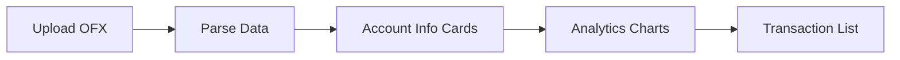

# OFX Reader UI Enhancement Plan

## Overview

Enhance the existing single-file OFX Reader webapp with lightweight external libraries while maintaining the single HTML file architecture. The goal is to add sophisticated analytics, smoother animations, and professional icons without converting to a framework-based application.

> **⚠️ Offline Requirement**: All libraries will be inlined directly into the HTML file for true offline functionality.

---

## Libraries to Integrate (INLINED)

| Library | Version | Purpose | Size (minified) |
|---------|---------|---------|-----------------|
| **Chart.js** | 4.4.x | Financial analytics charts | ~200KB |
| **GSAP** | 3.12.x | Advanced animations | ~60KB |
| **Phosphor Icons** | Latest | Professional icon set | ~15KB (CSS only) |

**Implementation**: Libraries downloaded and inlined as `<script>` and `<style>` blocks in the HTML file.

---

## UI/UX Enhancement Modules

### 1. Analytics Dashboard

**New Component: Financial Charts Section**

Add a dedicated analytics section between account info and transaction list:



**Chart Types:**

1. **Monthly Cash Flow (Bar Chart)**
   - Compare credits vs debits per month
   - Vertical grouped bars
   - Green for credits, red for debits

2. **Category Breakdown (Doughnut Chart)**
   - Show spending categories if memo contains keywords
   - Categories: Utilities, Shopping, Food, Transfer, Other
   - Interactive legend

3. **Daily Balance Trend (Line Chart)**
   - Running balance over time
   - Gradient fill under line
   - Tooltip showing date and balance

4. **Summary Stats Cards**
   - Total Credits
   - Total Debits
   - Net Balance
   - Average Transaction

---

### 2. Enhanced Animations (GSAP)

**Page Load Sequence:**

1. Header slides down with fade (0.4s)
2. Upload zone scales in from 0.9 with bounce (0.5s, stagger: 0.1)
3. Info cards stagger in from bottom (0.3s each)
4. Charts animate draw-in sequentially

**Micro-interactions:**

- Upload zone pulse on hover
- Cards lift with shadow on hover
- Transaction items slide in on scroll
- Loading spinner morphs between states
- Success checkmark animation

**Transaction List Enhancements:**

- Staggered entrance animation (50ms between items)
- Hover: slide right + glow
- Click: expand for details with GSAP flip

---

### 3. Professional Icons (Phosphor Icons)

Replace all emoji icons with Phosphor icons:

| Current | New |
|---------|-----|
| 📊 | `ph-chart-pie-slice` |
| 📁 | `ph-folder-open` |
| 🏠 | `ph-bank` |
| 📋 | `ph-list-checks` |
| ⚠️ | `ph-warning` |
| ✅ | `ph-check-circle` |
| 💳 | `ph-credit-card` |
| 📅 | `ph-calendar` |
| 💰 | `ph-money` |
| 🔄 | `ph-arrows-clockwise` |

---

### 4. Additional UI Enhancements

**Transaction List:**

- Search/filter input with real-time filtering
- Sort dropdown (date, amount, description)
- Pagination or virtual scroll for large datasets
- Category badges based on memo keywords

**Upload Zone:**

- Drag-over visual feedback with border animation
- File type validation with toast notification
- File size display after selection

**Loading States:**

- Skeleton loaders for cards and charts
- Progress bar during file parsing
- Optimistic UI updates

**Responsive Design:**

- Charts stack vertically on mobile
- Collapsible sidebar on tablet
- Touch-friendly interactions

---

## Implementation Phases

### Phase 1: Foundation
- [ ] Download Chart.js minified bundle (~200KB)
- [ ] Download GSAP minified bundle (~60KB)
- [ ] Download Phosphor Icons CSS (~15KB)
- [ ] Inline all libraries directly into index.html
- [ ] Set up CSS variables for chart colors

### Phase 2: Analytics Dashboard
- [ ] Create analytics section HTML structure
- [ ] Implement Chart.js with 4 chart types
- [ ] Add summary stat cards
- [ ] Wire up data from OFX parser

### Phase 3: GSAP Animations
- [ ] Implement page load sequence
- [ ] Add card hover animations
- [ ] Create transaction list staggered entrance
- [ ] Add upload zone interactions

### Phase 4: Icon Migration
- [ ] Replace header icons
- [ ] Replace info card icons
- [ ] Replace transaction list icons
- [ ] Replace status/loading icons

### Phase 5: Polish
- [ ] Add search/filter to transactions
- [ ] Add sort functionality
- [ ] Enhance mobile responsiveness
- [ ] Performance optimization

---

## Technical Considerations

### Chart.js Configuration

```javascript
// Global defaults
Chart.defaults.color = '#90caf9';
Chart.defaults.borderColor = 'rgba(144, 202, 249, 0.1)';
Chart.defaults.font.family = "'Segoe UI', sans-serif";

// Color palette matching dark theme
const chartColors = {
  credit: '#4caf50',
  debit: '#f44336',
  primary: '#1976d2',
  accent: '#00e5ff'
};
```

### GSAP Integration

```javascript
// Register GSAP plugins
gsap.registerPlugin(ScrollTrigger);

// Smooth scroll animations
gsap.from('.transaction-item', {
  scrollTrigger: '.transaction-list',
  y: 20,
  opacity: 0,
  stagger: 0.05,
  duration: 0.3
});
```

### Performance Targets

- Initial load: < 2 seconds
- Chart render: < 500ms
- Animation frame rate: 60fps
- Total file size increase: < 100KB (compressed)

---

## Backward Compatibility

- All current functionality preserved
- Charts gracefully hide if no data
- Animations disabled for `prefers-reduced-motion`
- Works without JavaScript for basic file display

---

## File Structure

Single HTML file with inline sections:

```
index.html
├── <head>
│   ├── Meta tags
│   ├── Library CDNs (Chart.js, GSAP, Phosphor)
│   └── Existing CSS (preserved)
├── <body>
│   ├── Header (enhanced icons)
│   ├── Upload Zone (enhanced interactions)
│   ├── Account Info (enhanced cards)
│   ├── NEW: Analytics Dashboard (charts)
│   ├── Transaction List (enhanced + search)
│   └── Scripts (enhanced)
└── </html>
```
